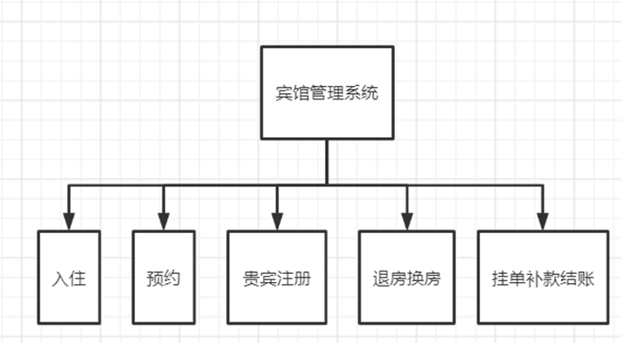

# 宾馆管理系统

### 介绍
19级软件实践课程作业。作业时间紧，小组内四个人分别开发不同的功能。还有很多未完善的功能

### 项目功能

### 项目技术

使用Maven项目结构。数据库采用MySQL ，并用navicat可视化工具进行管理。数据传输交互采用servlet、ajax、json。前端UI采用layui框架，套用layuimini模板，使用基于jquery及javascript的jsp页面实现。使用IDEA作为开发工具，并将网页部署在Tomcat上运行。

- MySQL 8.0
- Tomcat 8.5以上（包括8.5）
- JDK 1.8

### 前端页面

使用Layui-mini 后台admin前端模板。

**样式：**[layuimini-iframe版 v2 - 基于Layui的后台管理系统前端模板 (99php.cn)](http://layuimini.99php.cn/iframe/v2/index.html#/page/welcome-3.html)

**说明文档**：[简介 · layuimini开发手册 (99php.cn)](http://layuimini.99php.cn/docs/)

